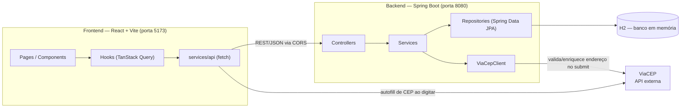

# ConnectAuto

Sistema de gestão de estoque de veículos para concessionárias: cadastro de veículos e concessionárias, associação entre eles, com backend em Spring Boot e frontend em React.

## Stack

- **Backend**: Java 21, Spring Boot 4, Spring Data JPA, H2 (banco em memória)
- **Frontend**: React 19, TypeScript, Vite, TanStack Query, React Hook Form + Zod, React Router

## Arquitetura



O frontend é organizado em camadas (`services/api` → `hooks` → `components`/`pages`): `services/api` faz as chamadas HTTP puras, `hooks` embrulha isso em `useQuery`/`useMutation` do TanStack Query, e componentes/páginas só consomem os hooks — nunca chamam `fetch` diretamente. O backend segue o mesmo espírito em camadas: `Controller` (HTTP) → `Service` (regra de negócio) → `Repository` (JPA/H2), com DTOs de request/response mapeados para as entidades via MapStruct.

**Integração com o ViaCEP acontece dos dois lados, por motivos diferentes:**

- O **frontend** chama o ViaCEP diretamente do navegador enquanto o usuário digita o CEP, para preencher logradouro/bairro/cidade/estado na hora (feedback rápido, sem depender de round-trip pelo backend).
- O **backend** chama o ViaCEP de novo, através do `ViaCepClient`, no momento de salvar uma concessionária — o servidor nunca confia no endereço que o cliente mandou, então valida e enriquece o endereço por conta própria antes de persistir.

### Principais decisões técnicas

- **Arquitetura em camadas nos dois lados** (controller/service/repository no backend; api/hooks/componentes no frontend), separando I/O, regra de negócio e UI.
- **TanStack Query** no lugar de `useState`/`useEffect` manual para dados de servidor: cache, loading/error state e invalidação após mutações já vêm prontos.
- **Zod + React Hook Form espelhando as validações do backend** (Bean Validation nos DTOs): feedback imediato no formulário, mas o backend sempre revalida tudo — o frontend nunca é a única linha de defesa.
- **H2 em memória**: zero setup para rodar localmente ou testar, ao custo de perder os dados a cada reinício do backend (documentado na seção [Banco H2](#banco-h2)).
- **CORS via `WebMvcConfigurer`** com a origem permitida configurável por `connectauto.cors.allowed-origins`, em vez de Spring Security — a API não tem autenticação neste estágio, então Security adicionaria complexidade sem necessidade real.
- **MapStruct** para mapear Entity ↔ DTO, evitando conversão manual e mantendo as entidades JPA fora dos controllers.
- **Tratamento de erro centralizado** (`@RestControllerAdvice`): todo erro da API volta no mesmo formato (`ApiError`: timestamp/status/mensagem/detalhes), e o `httpClient` do frontend sabe extrair essa mensagem de forma genérica pra exibir ao usuário.
- **Testes automatizados no frontend** com Vitest + Testing Library, mockando a camada `services/api` (não os hooks), cobrindo os formulários principais e as listagens.

## Pré-requisitos

| Ferramenta | Versão                          |
| ---------- | -------------------------------- |
| Java (JDK) | 21                                |
| Node.js    | ^20.19.0 ou >=22.12.0             |
| npm        | instalado junto com o Node        |

Não é necessário instalar Maven: o projeto inclui o Maven Wrapper (`mvnw` / `mvnw.cmd`).

## Como rodar o backend

```bash
cd backend

# Linux / macOS
./mvnw spring-boot:run

# Windows
mvnw.cmd spring-boot:run
```

A API sobe em `http://localhost:8080`. Endpoints principais: `/vehicles` e `/dealer`.

Para gerar o `.jar` e rodar via `java -jar`:

```bash
./mvnw clean package
java -jar target/*.jar
```

## Como rodar o frontend

```bash
cd frontend
npm install
npm run dev
```

A aplicação sobe em `http://localhost:5173` e já vem configurada para chamar o backend em `http://localhost:8080` (veja [Variáveis de ambiente](#variáveis-de-ambiente)).

Outros scripts disponíveis:

```bash
npm run build         # build de produção (tsc + vite build)
npm run lint           # oxlint
npm run format          # formata com Prettier
npm run format:check     # verifica formatação sem alterar arquivos
npm run test              # roda os testes (Vitest) uma vez
npm run test:watch         # roda os testes em modo watch
```

## Variáveis de ambiente

O frontend lê a URL do backend da variável `VITE_API_URL`.

```bash
cd frontend
cp .env.example .env
```

`.env.example`:

```
VITE_API_URL=http://localhost:8080
```

Se a variável não estiver definida, o app usa `http://localhost:8080` como padrão (e avisa no console do navegador).

O backend não exige nenhuma variável de ambiente para rodar localmente — a configuração fica em `backend/src/main/resources/application.properties` (banco H2 em memória, CORS liberado para `http://localhost:5173`, etc.).

## Banco H2

O backend usa H2 **em memória**: os dados existem só enquanto o processo do backend está rodando e somem a cada reinício.

### Acessar o console

1. Com o backend rodando, acesse `http://localhost:8080/h2-console`
2. Preencha o formulário de login exatamente assim:
   - **JDBC URL**: `jdbc:h2:mem:connectauto`
   - **User Name**: `sa`
   - **Password**: *(deixe em branco)*
3. Clique em **Connect**

De lá dá para rodar SQL direto (`SELECT * FROM DEALER`, `SELECT * FROM VEHICLE`, etc.) e inspecionar as tabelas que o Hibernate cria automaticamente.

### Popular o banco

Como o banco começa vazio a cada `mvnw spring-boot:run`, cadastre dados via requisições HTTP à própria API. Com o backend no ar:

```bash
# criar uma concessionária
curl -X POST http://localhost:8080/dealer \
  -H "Content-Type: application/json" \
  -d '{
    "razaoSocial": "Auto Center Silva Ltda",
    "cnpj": "11222333000181",
    "endereco": {
      "cep": "01310100",
      "logradouro": "Avenida Paulista",
      "bairro": "Bela Vista",
      "cidade": "Sao Paulo",
      "estado": "SP"
    }
  }'

# criar um veículo
curl -X POST http://localhost:8080/vehicles \
  -H "Content-Type: application/json" \
  -d '{
    "marca": "Toyota",
    "modelo": "Corolla",
    "tipoCombustivel": "FLEX",
    "cor": "Prata",
    "ano": 2022,
    "chassi": "9BWZZZ377VT004251",
    "valor": 120000,
    "corInterna": "Preto"
  }'
```

`tipoCombustivel` aceita: `GASOLINA`, `ETANOL`, `FLEX`, `DIESEL`, `ELETRICO`, `HIBRIDO`. O CNPJ precisa ter dígito verificador válido; o `cep` da concessionária é validado e enriquecido automaticamente via ViaCEP no momento do cadastro.

Também é possível cadastrar pelo próprio frontend, em `http://localhost:5173`, nas telas de Veículos e Concessionárias.
