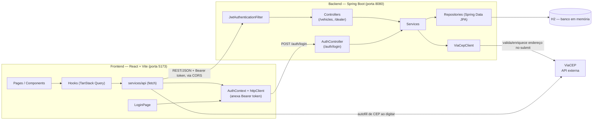
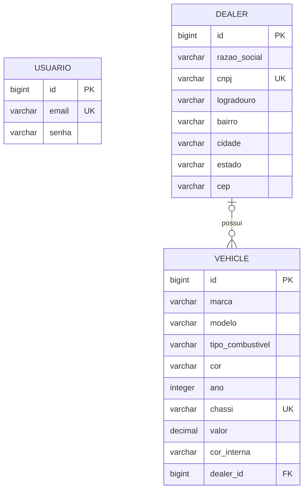

# ConnectAuto

Sistema de gestão de estoque de veículos para concessionárias: login, cadastro de veículos e concessionárias, associação entre eles e um dashboard com dados reais — backend em Spring Boot e frontend em React.

## Credenciais de acesso

> [!IMPORTANT]
> A aplicação tem **login obrigatório** — sem essas credenciais você não acessa nenhuma tela além de `/login`. Usuário único, sem tela de cadastro, seedado automaticamente no banco na primeira subida do backend:
>
> | Campo | Valor                          |
> | ----- | ------------------------------- |
> | URL   | `http://localhost:5173/login`   |
> | Email | `admin@connectauto.com.br`      |
> | Senha | `connectauto123`                |
>
> Essas são credenciais de **desenvolvimento**, definidas em `backend/src/main/resources/application.properties` (`connectauto.security.admin-email` / `connectauto.security.admin-password`). Antes de qualquer deploy real, sobrescreva-as (e o `connectauto.security.jwt-secret`) via variável de ambiente — veja [Variáveis de ambiente](#variáveis-de-ambiente).

## Stack

- **Backend**: Java 21, Spring Boot 4, Spring Data JPA, Spring Security + JWT (JJWT), H2 (banco em memória)
- **Frontend**: React 19, TypeScript, Vite, TanStack Query, React Hook Form + Zod, React Router

## Arquitetura



O frontend é organizado em camadas (`services/api` → `hooks` → `components`/`pages`): `services/api` faz as chamadas HTTP puras (via `httpClient`, que anexa o token de sessão automaticamente), `hooks` embrulha isso em `useQuery`/`useMutation` do TanStack Query, e componentes/páginas só consomem os hooks — nunca chamam `fetch` diretamente. O `AuthContext` guarda a sessão (token + e-mail) e uma rota `RequireAuth` redireciona para `/login` sempre que não há sessão válida. O backend segue o mesmo espírito em camadas: `Controller` (HTTP) → `Service` (regra de negócio) → `Repository` (JPA/H2), com DTOs de request/response mapeados para as entidades via MapStruct. Toda rota exceto `/auth/login` exige um JWT válido, verificado pelo `JwtAuthenticationFilter` antes de chegar no controller.

**Integração com o ViaCEP acontece dos dois lados, por motivos diferentes:**

- O **frontend** chama o ViaCEP diretamente do navegador enquanto o usuário digita o CEP, para preencher logradouro/bairro/cidade/estado na hora (feedback rápido, sem depender de round-trip pelo backend).
- O **backend** chama o ViaCEP de novo, através do `ViaCepClient`, no momento de salvar uma concessionária — o servidor nunca confia no endereço que o cliente mandou, então valida e enriquece o endereço por conta própria antes de persistir.

### Principais decisões técnicas

- **Arquitetura em camadas nos dois lados** (controller/service/repository no backend; api/hooks/componentes no frontend), separando I/O, regra de negócio e UI.
- **TanStack Query** no lugar de `useState`/`useEffect` manual para dados de servidor: cache, loading/error state e invalidação após mutações já vêm prontos.
- **Zod + React Hook Form espelhando as validações do backend** (Bean Validation nos DTOs): feedback imediato no formulário, mas o backend sempre revalida tudo — o frontend nunca é a única linha de defesa. CNPJ, CEP e valor do veículo têm máscara de digitação (`frontend/src/utils/masks.ts`), mas a validação de verdade continua no schema Zod e, por trás, no backend.
- **H2 em memória**: zero setup para rodar localmente ou testar, ao custo de perder os dados a cada reinício do backend (documentado na seção [Banco H2](#banco-h2)). Um `DemoDataSeeder` popula 8 concessionárias e 31 veículos automaticamente na primeira subida, pro dashboard não nascer vazio — desligado nos testes (`connectauto.demo-data.enabled=false` em `backend/src/test/resources/application.properties`), já que vários testes fazem asserções de contagem exata na base.
- **Autenticação stateless com JWT**: usuário único fixo (seedado no banco, sem tela de cadastro — veja [Credenciais de acesso](#credenciais-de-acesso)), senha com hash BCrypt, token JWT (8h de validade) enviado como `Authorization: Bearer`. `SecurityFilterChain` libera só `/auth/login`, `/h2-console/**`, Swagger e `/actuator/health`; todo o resto exige token. CORS também migrou pra dentro do `SecurityConfig` (via `HttpSecurity.cors(...)`), já que com Spring Security no ar ele intercepta a requisição antes de qualquer `WebMvcConfigurer`.
- **MapStruct** para mapear Entity ↔ DTO, evitando conversão manual e mantendo as entidades JPA fora dos controllers.
- **Tratamento de erro centralizado** (`@RestControllerAdvice`, mais `RestAuthenticationEntryPoint`/`RestAccessDeniedHandler` pros erros 401/403 da camada de segurança): todo erro da API volta no mesmo formato (`ApiError`: timestamp/status/mensagem/detalhes), e o `httpClient` do frontend sabe extrair essa mensagem de forma genérica pra exibir ao usuário.
- **Testes automatizados nos dois lados**: backend com JUnit + MockMvc (as suítes de controller rodam com `addFilters = false`, focadas em regra de negócio; a autenticação em si tem sua própria suíte, `AuthControllerTest`, com a cadeia de segurança real ativa); frontend com Vitest + Testing Library, mockando a camada `services/api` (não os hooks), cobrindo os formulários principais, as listagens e o fluxo de login.

## Pré-requisitos

| Ferramenta | Versão                          |
| ---------- | -------------------------------- |
| Java (JDK) | 21                                |
| Node.js    | ^20.19.0 ou >=22.12.0             |
| npm        | instalado junto com o Node        |

Não é necessário instalar Maven: o projeto inclui o Maven Wrapper (`mvnw` / `mvnw.cmd`).

## Como rodar o backend

```bash
cd backend

# Linux / macOS
./mvnw spring-boot:run

# Windows
mvnw.cmd spring-boot:run
```

A API sobe em `http://localhost:8080`. Na primeira subida (banco vazio), dois seeders rodam automaticamente: o usuário admin (veja [Credenciais de acesso](#credenciais-de-acesso)) e os dados de demonstração (8 concessionárias, 31 veículos). Endpoints principais: `/auth/login` (público) e `/vehicles`/`/dealer` (exigem `Authorization: Bearer <token>`).

Para gerar o `.jar` e rodar via `java -jar`:

```bash
./mvnw clean package
java -jar target/*.jar
```

## Como rodar o frontend

```bash
cd frontend
npm install
npm run dev
```

A aplicação sobe em `http://localhost:5173` e já vem configurada para chamar o backend em `http://localhost:8080` (veja [Variáveis de ambiente](#variáveis-de-ambiente)).

Outros scripts disponíveis:

```bash
npm run build         # build de produção (tsc + vite build)
npm run lint           # oxlint
npm run format          # formata com Prettier
npm run format:check     # verifica formatação sem alterar arquivos
npm run test              # roda os testes (Vitest) uma vez
npm run test:watch         # roda os testes em modo watch
```

## Variáveis de ambiente

O frontend lê a URL do backend da variável `VITE_API_URL`.

```bash
cd frontend
cp .env.example .env
```

`.env.example`:

```
VITE_API_URL=http://localhost:8080
```

Se a variável não estiver definida, o app usa `http://localhost:8080` como padrão (e avisa no console do navegador).

O backend não exige nenhuma variável de ambiente para rodar localmente — todas as propriedades abaixo já têm um valor padrão de desenvolvimento em `backend/src/main/resources/application.properties`. Para sobrescrever qualquer uma via variável de ambiente, use a convenção do Spring Boot (maiúsculo, `.` vira `_`):

| Propriedade                             | Variável de ambiente equivalente        | Padrão (dev)                     |
| ---------------------------------------- | ---------------------------------------- | --------------------------------- |
| `connectauto.security.admin-email`       | `CONNECTAUTO_SECURITY_ADMIN_EMAIL`       | `admin@connectauto.com.br`        |
| `connectauto.security.admin-password`    | `CONNECTAUTO_SECURITY_ADMIN_PASSWORD`    | `connectauto123`                  |
| `connectauto.security.jwt-secret`        | `CONNECTAUTO_SECURITY_JWT_SECRET`        | chave de 512 bits fixa no arquivo |
| `connectauto.security.jwt-expiration`    | `CONNECTAUTO_SECURITY_JWT_EXPIRATION`    | `8h`                              |
| `connectauto.cors.allowed-origins`       | `CONNECTAUTO_CORS_ALLOWED_ORIGINS`       | `http://localhost:5173`           |
| `connectauto.demo-data.enabled`          | `CONNECTAUTO_DEMO_DATA_ENABLED`          | `true`                            |

⚠️ Os valores padrão são de **desenvolvimento** — antes de qualquer deploy real, sobrescreva pelo menos `admin-password` e `jwt-secret` (gere uma chave nova, por exemplo com `node -e "console.log(require('crypto').randomBytes(64).toString('base64'))"`).

## Banco H2

O backend usa H2 **em memória**: os dados existem só enquanto o processo do backend está rodando e somem a cada reinício.

### Modelo de dados (DER)



Três tabelas — `usuario`, `dealer` e `vehicle` —, não quatro: o endereço da concessionária (`Endereco`) é um `@Embeddable` do JPA, então `logradouro`/`bairro`/`cidade`/`estado`/`cep` viram colunas direto na tabela `dealer`, sem tabela nem `JOIN` separados.

- `usuario` não se relaciona com as outras tabelas — é só a conta única usada pra logar (veja [Credenciais de acesso](#credenciais-de-acesso)); `senha` guarda o hash BCrypt, nunca a senha em texto puro.
- `dealer.cnpj` e `vehicle.chassi` têm restrição `UNIQUE`. `vehicle.chassi` fica `NULL` (não `""`) quando o veículo não tem chassi informado — duas strings vazias colidiriam na constraint de unicidade, dois `NULL` não.
- `vehicle.dealer_id` é **opcional** (nullable): um veículo pode existir sem concessionária associada — é assim que a issue de associação veículo↔concessionária consegue desvincular um veículo (`dealerId: null`).
- `vehicle.tipo_combustivel` guarda o enum Java (`GASOLINA`/`ETANOL`/`FLEX`/`DIESEL`/`ELETRICO`/`HIBRIDO`) como texto (`EnumType.STRING`), não como número — mais legível direto no banco e resiliente a reordenar os valores do enum no código.

### Acessar o console

1. Com o backend rodando, acesse `http://localhost:8080/h2-console`
2. Preencha o formulário de login exatamente assim:
   - **JDBC URL**: `jdbc:h2:mem:connectauto`
   - **User Name**: `sa`
   - **Password**: *(deixe em branco)*
3. Clique em **Connect**

De lá dá para rodar SQL direto (`SELECT * FROM DEALER`, `SELECT * FROM VEHICLE`, etc.) e inspecionar as tabelas que o Hibernate cria automaticamente.

### Popular o banco

O banco já sobe populado: o `DemoDataSeeder` cadastra 8 concessionárias e 31 veículos automaticamente na primeira subida com o banco vazio (é por isso que o dashboard não abre em branco). Pra desligar isso — por exemplo, pra testar o app do zero — defina `connectauto.demo-data.enabled=false` (veja [Variáveis de ambiente](#variáveis-de-ambiente)).

Pra cadastrar dados extras manualmente, use a própria API. Como todo endpoint (exceto `/auth/login`) exige token, logue primeiro:

```bash
# 1. login — guarda o token numa variável
TOKEN=$(curl -s -X POST http://localhost:8080/auth/login \
  -H "Content-Type: application/json" \
  -d '{"email":"admin@connectauto.com.br","senha":"connectauto123"}' \
  | grep -o '"token":"[^"]*"' | cut -d'"' -f4)

# 2. criar uma concessionária
curl -X POST http://localhost:8080/dealer \
  -H "Content-Type: application/json" \
  -H "Authorization: Bearer $TOKEN" \
  -d '{
    "razaoSocial": "Auto Center Silva Ltda",
    "cnpj": "98765432000198",
    "endereco": {
      "cep": "01310100",
      "logradouro": "Avenida Paulista",
      "bairro": "Bela Vista",
      "cidade": "Sao Paulo",
      "estado": "SP"
    }
  }'

# 3. criar um veículo
curl -X POST http://localhost:8080/vehicles \
  -H "Content-Type: application/json" \
  -H "Authorization: Bearer $TOKEN" \
  -d '{
    "marca": "Toyota",
    "modelo": "Corolla",
    "tipoCombustivel": "FLEX",
    "cor": "Prata",
    "ano": 2022,
    "chassi": "9BWZZZ377VT004251",
    "valor": 120000,
    "corInterna": "Preto"
  }'
```

`tipoCombustivel` aceita: `GASOLINA`, `ETANOL`, `FLEX`, `DIESEL`, `ELETRICO`, `HIBRIDO`. O CNPJ precisa ter dígito verificador válido; o `cep` da concessionária é validado e enriquecido automaticamente via ViaCEP no momento do cadastro.

Também é possível cadastrar pelo próprio frontend, em `http://localhost:5173`, nas telas de Veículos e Concessionárias — os campos de CNPJ, CEP e valor formatam sozinhos enquanto você digita.
